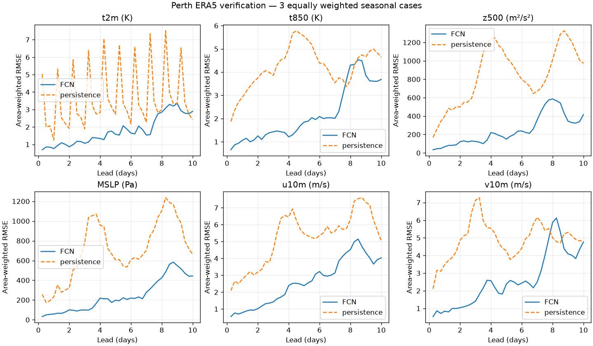

# Perth historical validation results

Read the [results and interpretation](../../plan/13_historical_validation.md) or
[executed validation notebook](../../notebooks/phase1_validation.ipynb).

These artifacts cover FCN/ERA5 forecasts initialized at 00 UTC on January 1,
July 1, and October 1, 2022, each run for ten days. Regional day-five temperature
RMSE is 1.580 K versus 2.728 K for persistence; day-ten RMSE is 2.893 K versus
2.432 K. Airport wind-speed results are mixed. Three cases do not establish
climatological skill.

- `grid_scores.csv`: area-weighted ERA5 scores for each case, field, model and lead.
- `station_scores.csv`: airport scores pooled across positive leads within each case.
- `station_scores_by_lead.csv`: airport scores for each lead, including coverage.
- `metadata.json`: configuration, scoring conventions, and checkpoint/data/code hashes.
- Dated figures: airport time series and regional temperature/error maps.

Run `pixi run validate` from the repository root to produce the complete workflow.
`pixi run validate --offline` requires local snapshots under `outputs/historical/`
and cached Cartopy coastlines. Raw forecasts and snapshots are git-ignored; the
notebook reads the report artifacts without downloading data or running inference.
